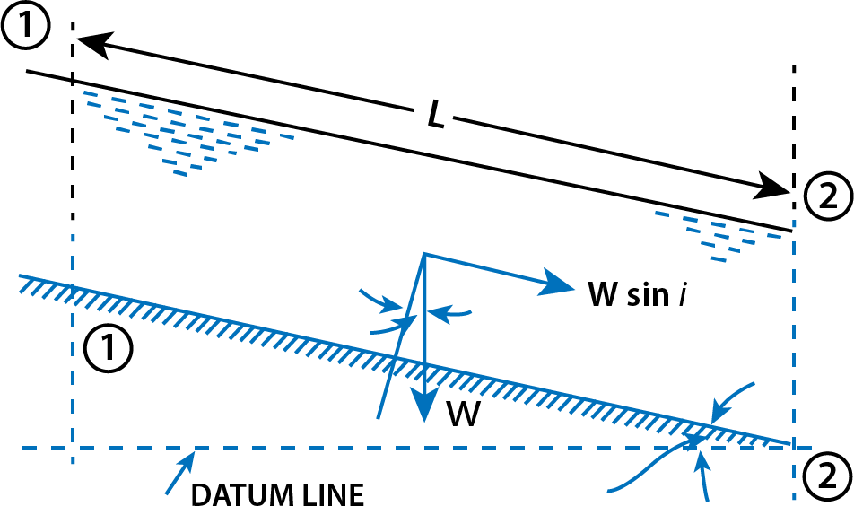
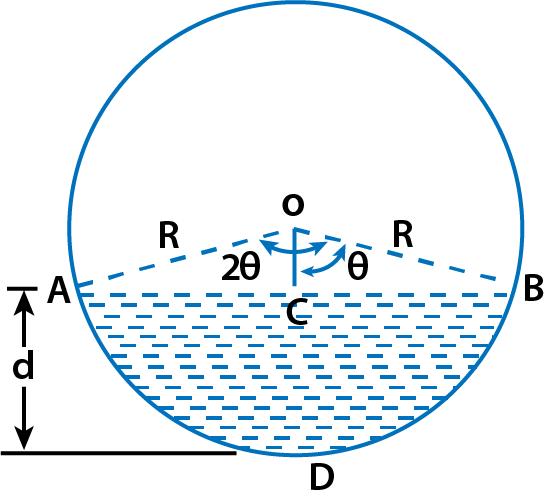

<h2>DISCHARGE THROUGH OPEN CHANNEL BY CHEZY'S FORMULA</h2>

Consider uniform flow of water in a channel as shown in Fig. 1. As the flow is uniform, it means the velocity, depth of flow and area of flow will be constant for a given length of the channel. Consider sections 1-1 and 2-2. 

$$ Figure\ 1: \ Uniform \ flow \ in \ open \ channel $$

let

&emsp; L = Length of channel,  
&emsp; A = Area of flow of water,  
&emsp; i = Slope of the bed,  
&emsp; V = Mean velocity of flow of water,  
&emsp; P = Wetted perimeter of the cross-section  
&emsp; F = The weight of water between sections 1-1 and 2-2 = Frictional resistance per unit velocity per unit area.  
&emsp; W = Specific weight of water × volume of water = WXAXL  

Component of W along direction of flow = W x sin i = wAL sin i  
Frictional resistance against motion of water = ƒ × surface area × (velocity )n &nbsp; &nbsp; &nbsp; &nbsp; ...(i)

The value of n is found experimentally equal to 2 and surface area = P x L  

Frictional resistance against motion = fx P x L x V2 &nbsp; &nbsp; &nbsp; &nbsp; ...(ii)  

The forces acting on the water between sections 1-1 and 2-2 are:  
1. Component of weight of water along the direction of flow,
2. Friction resistance against flow of water,
3. Pressure force at section 1-1,
4. Pressure force at section 2-2.

As the depths of water at the sections 1-1 and 2-2 are the same, the pressure forces on these two sections are same and acting in the opposite direction. Hence they cancel each other. In case of uniform flow, the velocity of flow is constant for the given length of the channel. Hence there is no acceleration acting on the water. Hence the resultant force acting in the direction of flow must be zero.

Resolving all forces in the direction of flow, we get:

$$
    wAL \sin i = f \times P \times L \times V^2 = 0
$$

or

$$ V^2 = \frac{wAL \sin i}{f \times P \times L} = \frac{w}{f} \times $$

or

$$ V = \sqrt{\frac{w}{f}} \times \frac{A}{P} \times \sin i $$

Letting A/P = m (hydraulic mean depth or hydraulic radius) and : 

$$ \sqrt{\frac{w}{f}} = C \ \ \ \ (Chezy's constant) $$

$$
    V = C \sqrt{m \sin i}
$$

For small values of i 

where
 

$$ \sin i \approx \tan i = i $$

We have,

$$
    V = C \sqrt{mi} \ \ \ \ \ \ ...(iii)
$$

Thus, the discharge Q is:

$$
    Q = A \times V = A \times C \sqrt{mi} \ \ \ \ \ \ ...(iv)
$$

 

<h2>Empirical Formulae for the Value of Chezy's Constant</h2>

Equation (iii) is known as Chezy’s formula, named after Antoine Chezy, a French engineer who developed it in 1975. In this equation, C is Chezy’s constant, which is not a dimensionless coefficient. The dimension of C is:

$$
    C = \frac{V}{\sqrt{mi}} = L^{1/2} T^{-1}
$$

Hence, the value of C depends on the units used. The following table provides empirical formulae for C based on different systems:

<h4>1. Bazinb Formula (In MKS units): </h4>

$$ C = \frac{157.6}{1.81 + \frac{K}{\sqrt{m}}} $$

where K is Bazin’s constant, depending on the channel surface roughness, with values provided in above

m = Hydraulic mean depth or hydraulic radius

<h4>2. Ganguillet-Kutter Formula</h4>

The value of <i>C</i> is given in MKS unit as

$$
    C = \frac{23 + \frac{0.00155}{i} + \frac{1}{N}}{1 + \left( 23 + \frac{0.00155}{i} \right) \frac{N}{\sqrt{m}}}
$$

where:

<ul>
    <li><i>N</i> = Roughness coefficient, also known as Kutter’s constant, whose value for different surfaces is given in Table 16.2</li>
    <li><i>i</i> = Slope of the bed</li>
    <li><i>m</i> = Hydraulic mean depth</li>
</ul>

<h3>Table 16.1 Values of K in the Bazin’s Formula</h3>
<table border="1" cellspacing="0" cellpadding="5">
    <tr>
        <th>S. No.</th>
        <th>Nature of Channel inside surface</th>
        <th>Value of <i>K</i></th>
    </tr>
    <tr>
        <td>1.</td>
        <td>Smooth cemented or planned wood</td>
        <td>0.11</td>
    </tr>
    <tr>
        <td>2.</td>
        <td>Brick or concrete or unplanned wood</td>
        <td>0.21</td>
    </tr>
    <tr>
        <td>3.</td>
        <td>Rubble masonry or Ashlar or poor brick work</td>
        <td>0.83</td>
    </tr>
    <tr>
        <td>4.</td>
        <td>Earthen channel of very good surface</td>
        <td>1.54</td>
    </tr>
    <tr>
        <td>5.</td>
        <td>Earthen channel of ordinary surface</td>
        <td>2.36</td>
    </tr>
    <tr>
        <td>6.</td>
        <td>Earthen channel of rough surface</td>
        <td>3.17</td>
    </tr>
</table>

<h3>Table 16.2 Value of N in the Ganguillet-Kutter Formula</h3>
<table border="1" cellspacing="0" cellpadding="5">
    <tr>
        <th>S. No.</th>
        <th>Nature of Channel inside surface</th>
        <th>Value of <i>N</i></th>
    </tr>
    <tr>
        <td>1.</td>
        <td>Very smooth surface of glass, plastic or brass</td>
        <td>0.010</td>
    </tr>
    <tr>
        <td>2.</td>
        <td>Smooth surface of concrete</td>
        <td>0.012</td>
    </tr>
    <tr>
        <td>3.</td>
        <td>Rubble masonry or poor brick work</td>
        <td>0.017</td>
    </tr>
    <tr>
        <td>4.</td>
        <td>Earthen channels neatly excavated</td>
        <td>0.018</td>
    </tr>
    <tr>
        <td>5.</td>
        <td>Earthen channels of ordinary surface</td>
        <td>0.027</td>
    </tr>
    <tr>
        <td>6.</td>
        <td>Earthen channels of rough surface</td>
        <td>0.030</td>
    </tr>
    <tr>
        <td>7.</td>
        <td>Natural streams, clean and straight</td>
        <td>0.030</td>
    </tr>
    <tr>
        <td>8.</td>
        <td>Natural streams with weeds, duppools etc.</td>
        <td>0.075 to .15</td>
    </tr>
</table>

<h4>3. Manning’s Formula</h4>

The value of <i>C</i> according to this formula is given as

$$
    C = \frac{1}{N} m^{1/6}
$$

where:

<ul>
    <li><i>m</i> = Hydraulic mean depth</li>
    <li><i>N</i> = Manning’s constant, which has the same value as Kutter’s constant for the normal range of slope and hydraulic mean depth. The values of <i>N</i> are given in Table 16.2.</li>
</ul>

 

<h2>Flow Through Circular Channel</h2>

The flow of a liquid through a circular pipe, when the level of liquid in the pipe is below the top of the pipe, is classified as an open channel flow. The rate of flow through a circular channel is determined from the depth of flow and angle subtended by the liquid surface at the center of the circular channel.

Fig. 2 Shows a circular channel through which water is flowing.

Let

<ul>
    <li><i>d</i> = depth of water,</li>
    <li> 2&theta; = angle subtended by water surface <i>AB</i> at the center in radians,</li>
    <li><i>R</i> = radius of the channel,</li>
</ul>

Then the wetted perimeter and wetted area are determined as:

Wetted perimeter,

$$
    P = \frac{2\pi R}{2\pi} \times 2\theta = 2R\theta
$$

Wetted area,

$$
    A = \text{Area ADBA}
$$

$$
    = \text{Area of sector OADBO - Area of }\triangle AABO
$$

$$
    = \frac{\pi R^2}{2\pi} \times 2\theta - \frac{AB \times CO}{2} = R^2 \theta - \frac{2BC \times CO}{2}
$$

$$
    = R^2 \theta - 2 \times R \sin \theta \times R \cos \theta \, / \, 2
$$

$$
    = R^2 \theta - \frac{R^2 \times 2 \sin \theta \cos \theta}{2} = R^2 \theta - \frac{R^2 \sin 2\theta}{2}
$$

$$
    = R^2 \left( \theta - \frac{\sin 2\theta}{2} \right)
$$

Then hydraulic mean depth,

$$
    m = \frac{A}{P} = \frac{R^2 \left( \theta - \frac{\sin 2\theta}{2} \right)}{2R\theta} = \frac{R}{2\theta} \left( \theta - \frac{\sin 2\theta}{2} \right)
  $$

And discharge, <i>Q</i> is given by,

$$
    Q = AC \sqrt{mi}
$$
